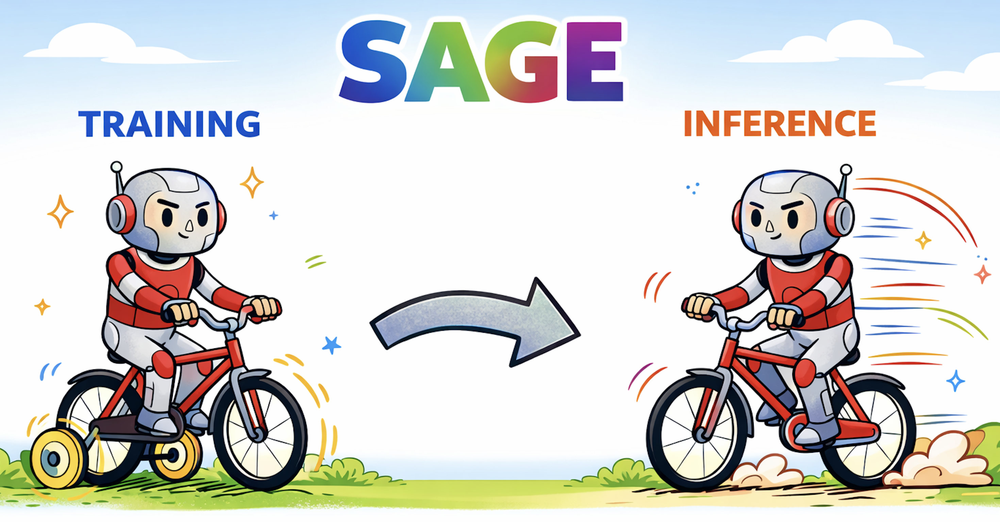

<div align="center">


<div align="center">

## Self-Hinting Language Models Enhance Reinforcement Learning

When signal loses for hard prompts during RL (all trajectories are wrong), LLM self-generates hint to help the sampling, improving both prompt usage and LLM performance.

</div>

<p align="center">
  <a href="https://www.arxiv.org/abs/2602.03143"></a>
  <a href="https://github.com/BaohaoLiao/SAGE"></a>
  <a href="https://huggingface.co/collections/baohao/sage"></a>
  <a href="https://huggingface.co/collections/baohao/sage"></a>
  <a href="assets/sage_slide.mp4"></a>
<a href="assets/sage_slide_chinese.mp4"></a>
</p>

</div>

## 🔥 News

- **[02/08/2026]** SAGE reproduction code is released! A [huggingface collection](https://huggingface.co/collections/baohao/sage) of dataset and models is also released.
- **[02/03/2026]** SAGE paper is released on [arXiv](https://www.arxiv.org/abs/2602.03143)!


## 🌟 Overview

## 📦 Installation
1. Create a new environmt
    ```bash
    python -m venv ~/.python/sage
    source ~/.python/sage/bin/activate

    # Or use conda
    # conda create -n sage python==3.10
    # conda activate sage
    ```
2. Install dependencies
    ```bash
    ```

python -m uv pip install torch==2.8.0 --index-url https://download.pytorch.org/whl/cu128
python -m uv pip install -U pip setuptools wheel packaging psutil
python -m uv pip install flash-attn==2.8.0.post2 --no-build-isolation

pip install flash-attn==2.8.0.post2 --no-build-isolation
pip install -r requirements.txt

## ⚡ Training
1. Prepare training set

    ```bash
    bash scripts/prepare_data.sh
    ```

2. Train with SAGE / SAGE-light. The key code locates in ```recipe/hint```.       

    ```bash
    bash scripts/run_sage.sh
    ```

3. Baselines (optional)
    - GRPO:
        ```bash
        bash scripts/run_grpo.sh
        ```
    - LUFFY: We use [LUFFY's open-sourced code](https://github.com/ElliottYan/LUFFY). The [training set](https://huggingface.co/datasets/baohao/luffy_train) is already preprocessed to LUFFY's style.
    - SFT: We use [LUFFY's open-sourced code](https://github.com/ElliottYan/LUFFY) for SFT. The [training set](https://huggingface.co/datasets/baohao/luffy_train) is already preprocessed to LUFFY's style.
    - Scaf-GRPO: We use [Scaf-GRPO's open-sourced code](https://github.com/JIA-Lab-research/Scaf-GRPO). The [training set](https://huggingface.co/datasets/baohao/scaf-grpo_train) is already preprocessed to Scaf-GRPO's style.

## 🎓 Evaluation

## 📝 Citation

If you find SAGE useful, please cite:

```bibtex
@misc{liao2026selfhintinglanguagemodelsenhance,
      title={Self-Hinting Language Models Enhance Reinforcement Learning}, 
      author={Baohao Liao and Hanze Dong and Xinxing Xu and Christof Monz and Jiang Bian},
      year={2026},
      eprint={2602.03143},
      archivePrefix={arXiv},
      primaryClass={cs.LG},
      url={https://arxiv.org/abs/2602.03143}, 
}
```

## 🙏 Acknowledgments